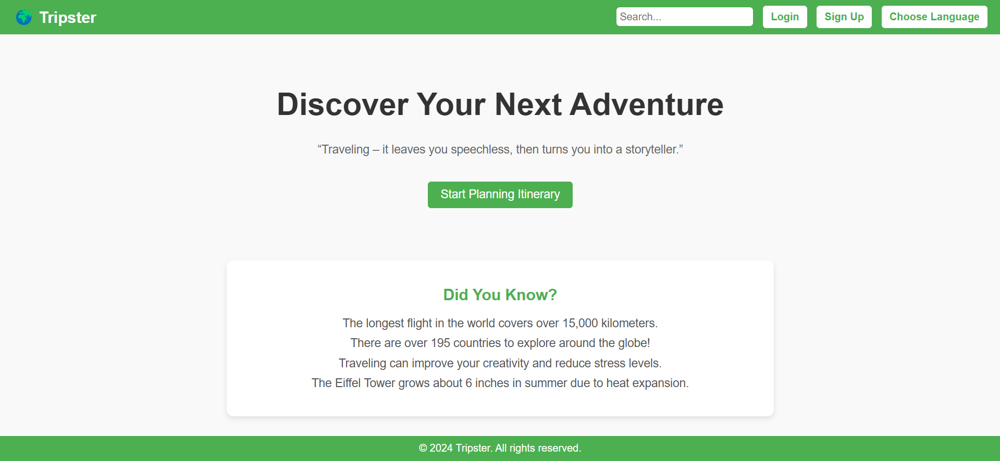
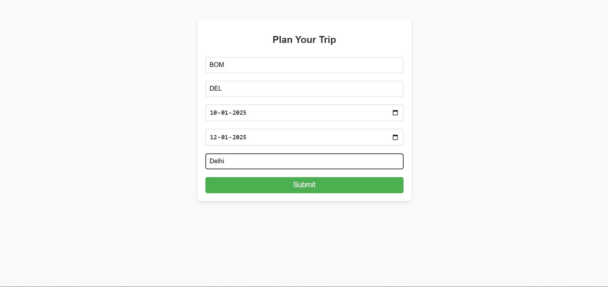

# Tripster: The Ultimate Vacation Planner 🌍✨

Tripster is an intelligent, web-based vacation planning application built using Flask. Designed with simplicity and efficiency in mind, it transforms raw data into actionable insights to help you organize your dream trips with ease. Whether you're looking for the best flights, comfortable hotels, reliable cabs, or exciting activities, Tripster has got you covered—all while maintaining an elegant user interface.

---

## 🚀 Features
- **Dynamic Data Integration**: Automatically fetch and display travel data (flights, hotels, cabs, and activities) from structured CSV files.
- **Responsive Design**: Crafted with a modern aesthetic to look stunning on all devices—desktops, tablets, and mobile phones.
- **User-Friendly Navigation**: A seamless flow from trip planning to results display with minimal clicks.
- **Customizable Input Fields**: Users can specify their travel preferences, including departure/arrival cities, dates, and hotel destinations.
- **Data Visualization**: Tabular presentation of travel options for easy comparison and decision-making.
- **Lightweight Backend**: Powered by Flask, making the application fast and easy to deploy.

---

## 📂 Project Structure
```
tripster/
├── app.py              # Main application logic (Flask backend)
├── templates/          # Frontend templates for rendering pages
│   ├── index.html      # Home page template
│   ├── plan.html       # Trip planning form
│   ├── results.html    # Dynamic results page
├── static/             # Directory for static assets (CSS, images, etc.)
├── flights.csv         # CSV data for flights
├── hotels.csv          # CSV data for hotels
├── Cab.csv             # CSV data for cab services
├── Activity.csv        # CSV data for activities/points of interest
└── README.md           # Project documentation
```

---

## 🛠️ Technology Stack
Tripster leverages cutting-edge technologies to provide a seamless experience:
- **Backend**: Flask, a lightweight yet powerful Python web framework.
- **Frontend**: HTML5, CSS3, and Jinja2 templating for dynamic content rendering.
- **Data Processing**: Pandas for reading and transforming CSV files.
- **Hosting**: Can be easily deployed on cloud platforms like AWS, Heroku, or Google Cloud.

---

## 💻 Installation and Setup

### Prerequisites
Ensure you have the following installed:
- Python 3.6 or later
- pip (Python package manager)

### Steps to Install
1. Clone the repository:
   ```bash
   git clone https://github.com/<your-username>/tripster.git
   cd tripster
   ```

2. Install dependencies:
   ```bash
   pip install flask pandas
   ```

3. Verify the presence of the CSV files in the root directory:
   - `flights.csv`
   - `hotels.csv`
   - `Cab.csv`
   - `Activity.csv`

4. Run the application:
   ```bash
   python app.py
   ```

5. Open your web browser and navigate to:
   ```
   http://127.0.0.1:5000/
   ```

---

## 🌐 Usage Guide
1. **Home Page**: The journey begins with a sleek homepage featuring a tagline and easy navigation.
2. **Plan Your Trip**:
   - Enter your trip details: departure/arrival locations, start and return dates, and hotel destination.
   - Submit the form to generate tailored travel options.
3. **Results Page**:
   - View curated results for flights, hotels, cabs, and activities in beautifully styled tables.
   - Analyze the data and finalize your travel plans.

---

## ✨ Key Highlights
- **Scalable Architecture**: Can be extended to integrate APIs (e.g., Google Flights, Booking.com) for real-time data.
- **Modular Design**: Easily add new features or replace data sources without affecting the existing structure.
- **Customizable UI**: The front end can be tailored to meet branding requirements.
- **Efficient Data Handling**: CSV-based architecture ensures fast and lightweight processing for smaller-scale projects.

---

## 📸 Screenshots
### 🏠 Home Page


### 📝 Trip Planning


### 📊 Results


---

## 🚀 Future Enhancements
- Integration with real-time APIs for live flight and hotel data.
- Advanced filtering and sorting capabilities for travel options.
- Enhanced visualizations with graphs and interactive maps.
- User authentication for personalized trip planning and saving itineraries.
- Multi-language support for global accessibility.

---

## 🤝 Contributing
Contributions are always welcome! Here’s how you can get started:
1. Fork the repository.
2. Create a new branch for your feature or bug fix:
   ```bash
   git checkout -b feature-name
   ```
3. Commit your changes and push to your branch:
   ```bash
   git push origin feature-name
   ```
4. Submit a pull request and describe the feature/fix in detail.

---

## 📜 License
This project is licensed under the MIT License. See the `LICENSE` file for details.

---

## 🙏 Acknowledgments
- **Flask**: For its lightweight yet robust web framework.
- **Pandas**: For simplifying data manipulation and analysis.
- **Open Source Community**: For inspiration and collaboration.

---
